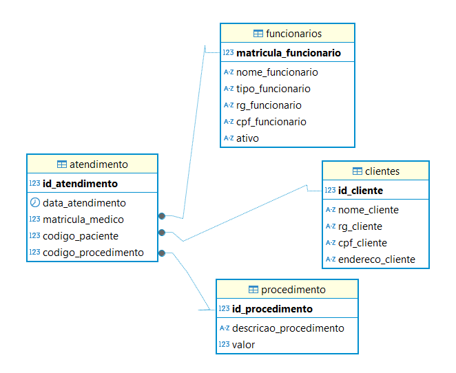

# Sistema-de-cadastros-de-clinica 🏥📊

Este projeto tem como objetivo a criação de um sistema para o controle de atendimentos em uma clínica. O banco de dados foi desenvolvido usando MariaDB e a interface de administração DBEAVER. Abaixo, detalharemos as funcionalidades e as tabelas que foram implementadas no sistema SISCLI (Sistema de Clínica).

## Objetivo do Sistema 🎯
O objetivo principal do SISCLI é gerenciar os atendimentos realizados aos pacientes da clínica. Isso inclui o controle de funcionários, pacientes, procedimentos médicos, atendimentos realizados, e relatórios de consultas realizadas.

## Funcionalidades do Sistema
### 1.1 Cadastro de Funcionário 👩‍⚕️👨‍⚕️
O sistema permite o cadastro de funcionários, como médicos e atendentes, com as seguintes informações:

 1.1.1 Cadastro de Funcionário 📋
Matrícula: Número da matrícula do funcionário.
Nome: Nome completo do funcionário.
Tipo: Tipo de Funcionário (Médico ou Atendente).
RG: Número do RG do funcionário.
CPF: Número do CPF do funcionário.
Ativo: Indicador de se o funcionário está ativo no sistema (sim ou não).
1.1.2 Consulta de Funcionário 🔍
Permite consultar as informações de um funcionário, como:

Nome: Buscar pelo nome do funcionário.
### 1.2 Cadastro de Pessoas 👥
Este módulo permite cadastrar pessoas que são atendidas na clínica, incluindo pacientes e acompanhantes.

1.2.1 Cadastro de Pessoas 📋
Código: Identificador único do paciente.
Nome: Nome completo da pessoa.
RG: Número do RG da pessoa.
CPF: Número do CPF da pessoa.
Endereço: Endereço completo da pessoa.
1.2.2 Consulta de Pessoas 🔍
Permite consultar informações sobre as pessoas cadastradas, como:

Nome: Buscar pelo nome da pessoa.
### 1.3 Cadastro de Procedimento 🩺
Os procedimentos médicos realizados na clínica também são cadastrados no sistema, com as seguintes informações:

1.3.1 Cadastro de Procedimento 📋
Código: Identificador único do procedimento.
Descrição: Descrição completa do procedimento médico.
Valor: Valor cobrado pelo procedimento.
1.3.2 Consulta de Procedimento 🔍
Permite consultar os procedimentos cadastrados, incluindo:

Nome do Procedimento: Consultar o nome do procedimento médico.
### 1.4 Cadastro de Atendimento 💉
Este módulo armazena os atendimentos realizados na clínica, incluindo os dados de médicos, pacientes e procedimentos executados.

1.4.1 Cadastro de Atendimento 📋
Código: Identificador único do atendimento.
Data: Data em que o atendimento foi realizado.
Médico: Referência ao funcionário com o tipo "Médico" que realizou o atendimento.
Paciente: Referência ao paciente que foi atendido.
Procedimento: Referência ao procedimento realizado durante o atendimento.
1.4.2 Consulta de Atendimento 🔍
Permite consultar as informações do atendimento, incluindo:

Nome do Médico: Buscar pelo nome do médico que realizou o atendimento.
### 1.5 Relatório 📊
O sistema permite gerar relatórios com base em atendimentos realizados. O relatório pode ser filtrado por período, médico e procedimento realizado, facilitando a análise e controle das ações da clínica.

## Estrutura do Banco de Dados 🗂️
As tabelas principais que compõem o banco de dados são:

Funcionários: Armazena informações sobre os médicos e atendentes.
Pessoas: Armazena os dados dos pacientes e pessoas atendidas.
Procedimentos: Armazena os tipos de procedimentos médicos realizados.
Atendimentos: Armazena os registros dos atendimentos realizados aos pacientes.
Diagrama Relacional ⚙️
Aqui está o diagrama representando as relações entre as tabelas do banco de dados:

lua
Copiar
+----------------+          +----------------+          +----------------+           +-------------------+
| Funcionarios   |          | Pessoas        |          | Procedimentos  |           | Atendimentos      |
+----------------+          +----------------+          +----------------+           +-------------------+
| id_funcionario |<-------->| id_pessoa      |          | id_procedimento|           | id_atendimento    |
| nome           |          | nome           |          | descricao      |           | data_atendimento  |
| tipo           |          | rg             |          | valor          |           | fk_funcionario    |
| rg             |          | cpf            |          +----------------+           | fk_paciente       |
| cpf            |          | endereco       |                                      | fk_procedimento   |
| ativo          |          +----------------+                                      +-------------------+
+----------------+                                                                 
## Tecnologias Utilizadas 💻
MariaDB: Sistema de Gerenciamento de Banco de Dados (SGBD) utilizado para armazenar os dados.
DBEAVER: Ferramenta de administração de banco de dados usada para criar e gerenciar o banco de dados.
Instruções de Uso 📄
Clone o repositório:

bash
Copiar
git clone https://github.com/Taynah-M-Alves/Sistema-de-cadastros-de-clinica.git
Importe o banco de dados no MariaDB:

Crie um banco de dados no MariaDB com o nome clinica.
Importe os arquivos .sql para criar as tabelas e dados.
Configuração do DBEAVER:

Abra o DBEAVER e conecte-se ao seu servidor MariaDB.
Importe o banco de dados para o DBEAVER para visualizar e interagir com as tabelas.
Contribuindo 🤝
Se você deseja contribuir para este projeto, siga as etapas abaixo:

Fork o repositório.

Crie uma branch para sua modificação:

bash
Copiar
git checkout -b minha-alteracao
Faça commit das suas alterações:

bash
Copiar
git commit -m "Descrição das alterações"
Envie as alterações para o repositório remoto:

bash
Copiar
git push origin minha-alteracao
Abra um pull request explicando as alterações realizadas.

Licença 📜
Este projeto está licenciado sob a Licença MIT - veja o arquivo LICENSE para mais detalhes.

Essa documentação foi criada para ajudar no entendimento do Sistema de Cadastro de Clínica. Se houver dúvidas, sinta-se à vontade para abrir uma issue no repositório. 😊
